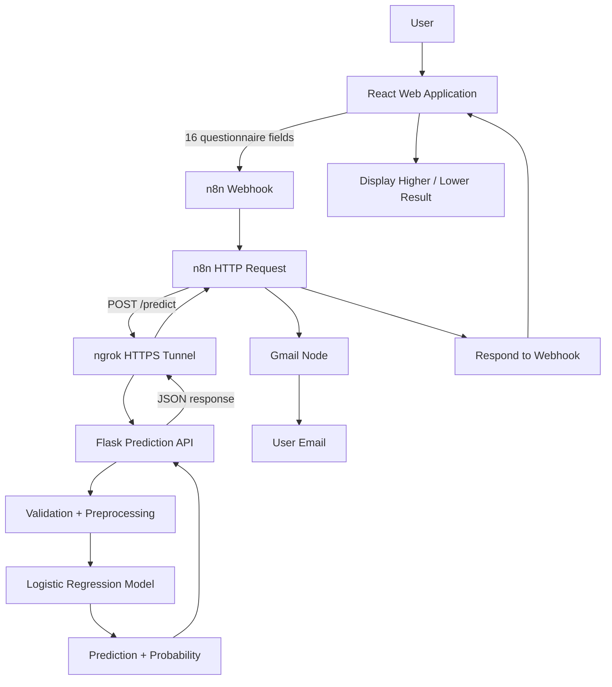

# Diabetes Risk Screening — Project Flow & Features

## 1. Project Overview

This project is an **ML-powered early diabetes risk screening application**.

A user answers a short questionnaire containing demographic information and commonly reported symptoms/signs. The React frontend sends the responses to **n8n Cloud**, which calls a **Flask REST API**. Flask validates and preprocesses the input, loads the trained **Logistic Regression** model, and returns a risk class and probability. n8n can then send the result through **Gmail** and return the result to the React application.

> **Important:** This is a screening/educational project, not a medical diagnostic system. A "Higher" result should not be interpreted as a confirmed diagnosis.

---

## Documentation & Privacy Note

This document intentionally contains **no passwords, API keys, access tokens, personal email addresses, ngrok URLs, webhook secrets, or real user questionnaire records**.

If this project is published online (GitHub, portfolio, LinkedIn, etc.), do not commit:

- `.env` files containing secrets
- n8n credentials or exported credential data
- Gmail OAuth tokens or API keys
- Real user questionnaire responses
- Real email addresses or other personally identifiable information
- Private webhook URLs or authentication secrets
- Production logs containing request payloads

Use placeholders such as `<API_KEY>`, `<WEBHOOK_URL>`, `<EMAIL>`, and synthetic test data in public documentation.

## 2. Technologies

| Component | Technology | Purpose |
|---|---|---|
| Frontend | React + Vite | Questionnaire and result display |
| Automation | n8n Cloud | Connects the application, ML API and Gmail |
| ML API | Flask | Serves the trained model |
| Model | Logistic Regression | Predicts the screening class |
| Preprocessing | Pandas + StandardScaler | Converts input into model-ready data |
| Model storage | Joblib (`.pkl`) | Saves/loads the trained model |
| Tunnel | ngrok | Exposes local Flask to n8n Cloud |
| Email | Gmail via n8n | Sends the screening result |

---

## 3. Dataset

The project uses the **UCI Early Stage Diabetes Risk Prediction Dataset**.

- 520 instances
- 16 input features
- Questionnaire-based demographic and symptom/sign information
- Target classes: `Positive` and `Negative`

### Final input features

`age`, `gender`, `polyuria`, `polydipsia`, `sudden_weight_loss`, `weakness`, `polyphagia`, `genital_thrush`, `visual_blurring`, `itching`, `irritability`, `delayed_healing`, `partial_paresis`, `muscle_stiffness`, `alopecia`, `obesity`

Encoding:

- `Female → 0`, `Male → 1`
- `No → 0`, `Yes → 1`
- `Negative → 0`, `Positive → 1`

The application presents the prediction as **Lower** or **Higher**.

---

# 4. Complete Architecture



---

# 5. Complete Execution Flow

### Step 1 — User opens React

The user sees a questionnaire containing age, gender and 14 symptom/sign questions.

### Step 2 — React collects the answers

Example:

```json
{
  "age": "<age>",
  "gender": "<gender>",
  "polyuria": "<Yes|No>",
  "polydipsia": "<Yes|No>",
  "sudden_weight_loss": "<Yes|No>",
  "weakness": "<Yes|No>",
  "polyphagia": "<Yes|No>",
  "genital_thrush": "<Yes|No>",
  "visual_blurring": "<Yes|No>",
  "itching": "<Yes|No>",
  "irritability": "<Yes|No>",
  "delayed_healing": "<Yes|No>",
  "partial_paresis": "<Yes|No>",
  "muscle_stiffness": "<Yes|No>",
  "alopecia": "<Yes|No>",
  "obesity": "<Yes|No>"
}
```

React sends this JSON to the n8n webhook.

### Step 3 — n8n receives the request

The **Diabetes Risk Webhook** starts the workflow and passes the questionnaire data to the HTTP Request node.

### Step 4 — n8n calls Flask

n8n sends a `POST` request to:

```text
https://<ngrok-domain>/predict
```

ngrok is used because Flask is running locally on:

```text
http://127.0.0.1:5000
```

The tunnel is:

```text
n8n Cloud → ngrok → localhost:5000
```

### Step 5 — Flask validates the input

Flask checks:

- All 16 required fields exist
- Age is numeric and between 1 and 120
- Gender is `Male` or `Female`
- Binary fields are `Yes` or `No`

### Step 6 — Flask preprocesses the input

Human-readable values are converted to the numerical representation used during training.

The data is placed into a Pandas DataFrame using the same feature order as training.

### Step 7 — Logistic Regression predicts

The saved model:

```text
diabetes_risk_model.pkl
```

receives the processed input and produces:

1. Predicted class
2. Positive-class probability

The class is mapped to:

```text
Positive → Higher
Negative → Lower
```

### Step 8 — Flask returns JSON

Example:

```json
{
  "risk": "Higher",
  "probability": 0.8734,
  "message": "Your responses indicate a higher chance of diabetes. Consider visiting a healthcare professional for a checkup."
}
```

### Step 9 — n8n processes the result

n8n receives the JSON response and can use its fields in subsequent nodes.

### Step 10 — Gmail sends the result

The Gmail node sends the screening result to the intended recipient's email address.

For demonstration, a test recipient can be configured without including any personal email address in the project documentation.

### Step 11 — n8n responds to React

The **Respond to Webhook** node sends the prediction back to the frontend.

React displays the final:

- Risk level
- Probability
- Recommendation/message

---

# 6. ML Model Performance

The selected model is **Logistic Regression**.

Reported performance on the project's held-out test split:

```text
Accuracy: 94.23%
```

Confusion matrix:

```text
[[39, 1],
 [ 5, 59]]
```

Classification report:

| Class | Precision | Recall | F1-score |
|---|---:|---:|---:|
| Lower / Negative | 0.89 | 0.97 | 0.93 |
| Higher / Positive | 0.98 | 0.92 | 0.95 |

This means the test split contained:

- 39 true negatives
- 1 false positive
- 5 false negatives
- 59 true positives

> These metrics describe the project's test split only. They should not be presented as clinical accuracy or evidence that the system can diagnose diabetes.

---

# 7. Project Features

## Frontend

- React + Vite interface
- Questionnaire-based input
- Form validation
- ML API integration
- Higher/Lower result
- Probability display
- Healthcare follow-up recommendation

## Machine Learning

- UCI Early Stage Diabetes dataset
- Data preprocessing
- Binary encoding
- Logistic Regression
- Train/test evaluation
- Probability prediction
- Joblib model serialization

## Flask API

- REST endpoint
- JSON input/output
- Required-field validation
- Age validation
- Gender validation
- Yes/No validation
- Health-check endpoint
- Prediction endpoint

## n8n Automation

- Webhook trigger
- HTTP Request to Flask
- Gmail integration
- Automated email delivery
- Webhook response to React

---

# 8. Why the Architecture Is Split

Each component has a clear responsibility:

```text
React       → User interaction
n8n         → Workflow automation
Flask       → ML model serving
Logistic Regression → Prediction
Gmail       → Result delivery
```

The ML model is therefore not embedded directly into React or n8n.

The main integration is:

```text
React → n8n → Flask → ML Model → n8n → React/Gmail
```

This also means the ML model can be replaced later without redesigning the entire frontend.

---

# 9. Final Execution Diagram

```text
┌─────────────────────────┐
│          USER           │
│  Answers questionnaire  │
└────────────┬────────────┘
             │
             ▼
┌─────────────────────────┐
│       REACT APP         │
│ Collect + validate data │
└────────────┬────────────┘
             │ JSON
             ▼
┌─────────────────────────┐
│      n8n WEBHOOK        │
│      Start workflow     │
└────────────┬────────────┘
             │
             ▼
┌─────────────────────────┐
│   HTTP REQUEST NODE     │
│       POST /predict     │
└────────────┬────────────┘
             │ HTTPS
             ▼
┌─────────────────────────┐
│      ngrok TUNNEL       │
└────────────┬────────────┘
             │
             ▼
┌─────────────────────────┐
│       FLASK API         │
│ Validate + preprocess   │
└────────────┬────────────┘
             │
             ▼
┌─────────────────────────┐
│   LOGISTIC REGRESSION   │
│       ML MODEL          │
└────────────┬────────────┘
             │
             ▼
┌─────────────────────────┐
│ RISK + PROBABILITY      │
│ Higher / Lower          │
└────────────┬────────────┘
             │
             ▼
┌─────────────────────────┐
│          n8n             │
│      Process result      │
└───────┬─────────┬───────┘
        │         │
        ▼         ▼
┌────────────┐ ┌────────────────┐
│   Gmail    │ │ Respond Webhook │
│ Send email │ │   → React       │
└─────┬──────┘ └───────┬────────┘
      │                │
      ▼                ▼
 User Email      Result on Webpage
```

---

# 10. Current Project Execution in 15 Steps

1. User opens the React application.
2. User answers the questionnaire.
3. React creates the JSON request.
4. React sends it to the n8n webhook.
5. n8n receives the request.
6. n8n sends the data to Flask using HTTP POST.
7. ngrok forwards the request to the local Flask server.
8. Flask validates the input.
9. Flask converts categorical values to numeric values.
10. Flask sends the data through the trained Logistic Regression pipeline.
11. The model produces a class and probability.
12. Flask returns the prediction as JSON.
13. n8n receives the result and sends it through Gmail.
14. n8n returns the result to React.
15. React displays the Higher/Lower screening result.

---

# 11. Limitations

- The dataset is relatively small.
- The model is based on a specific dataset rather than a broad clinical population.
- Questionnaire responses cannot replace medical tests.
- The output is not a medical diagnosis.
- ngrok is being used as a development tunnel.
- Flask is currently running locally.
- Production deployment would require appropriate hosting, authentication, security and monitoring.

---

# 12. Future Improvements

Possible extensions:

- Cloud deployment of the Flask API
- Production API endpoint instead of ngrok
- Authentication and user accounts
- Screening history
- Database integration
- Model comparison
- Cross-validation and hyperparameter tuning
- Feature-importance/explainability
- Better error handling
- Monitoring and logging
- Clinical validation

---

# 13. Presentation-Friendly Explanation

A concise way to explain the project is:

> **"This project demonstrates an end-to-end machine learning application in which a React frontend collects diabetes-related questionnaire data, n8n automates the workflow, a Flask API serves a Logistic Regression model, and the resulting screening prediction is returned to the frontend and delivered through Gmail."**

The key concept is:

```text
Machine Learning
       +
REST API
       +
Workflow Automation
       +
Web Application
       +
Email Automation
       =
End-to-End ML Application
```
